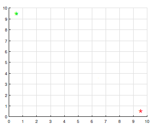
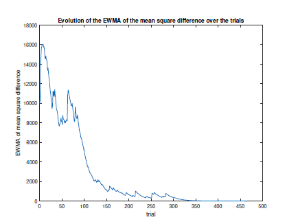
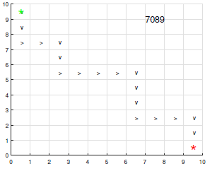

# Q-learning for Grid Navigation

### Synopsis ###
This project took place during the module _Neural networks_ at NUS (EE5904R).
It consists of making a robot traverse a 10 x 10 grid starting from the top-left cell of the grid and ending at the bottom-right cell. The grid is made of 100 cells and each cell corresponds to a state: the start cell corresponds to the state 1 (green star) and the goal cell to state 100 (red star).

  

The goal of the robot is to reach the state 100 by maximizing the total reward of the trip. Indeed, a reward is given to the robot depending on its current state _s_ and its next action _a_ (note that for a given state _s_, there are 4 different available actions _a_: up, left, down, right). There is an _optimal policy_ that corresponds to this maximal total reward: for a given state _s_, the optimal policy gives the better action _a_. Our goal is to find this optimal policy, and we use a Q-learning algorithm with _e_-greedy exploration to do it !

The Q-learning algorithm is based on the iterative update of the _Q-function_ until convergence. The _Q-function_ has two parameters, a state _s_ and an action _a_, and it measures the 'worth' of a pair of state-action (_s_,_a_) in terms of rewards. The _Q-function_ takes also into account the potential future rewards. The _optimal policy_ we have to find is the one that maximizes the values of the _Q-function_ over all possible (_s_,_a_).

The _e_-greedy exploration refers to the fact that at a given step of the trip, the robot has two distinct ways to choose his next action _a_:

* exploitation with a probability (1 - _e_): select the action _a_ which maximizes the Q function at the current step _s_
* exploration with a probability _e_: select randomly an action _a_ among the other available actions at the current step _s_

The exploration is essential for learning, but exploitation and exploration must be balanced: the probability _e_ decreases along the trip according to a probability function which has been carefully chosen.

The main steps of the Q-learning algorithm are:

1. Inputs: starting state, goal state, reward for each (_s_,_a_) (array 100 x 4), parameters of the Q-function, probability function for exploration
2. For each step k:

- select the next action _a_ by exploitation or exploration
- obtain the reward 
- define the next step _s_ according to the chosen action _a_
- update the _Q-function_

The step 2 is repeated until convergence of the _Q-function_.

### Results ###

One of the challenges of implementing the Q-learning algorithm is the convergence criterion of the _Q-function_. As a convergence criterion, I choose to compute the "mean-squared difference" between two consecutive Q-function values. Nevertheless the evolution of this variable is very noisy : very high values goes to very low values, then goes to high values. Thus nothing can be concluded about the convergence of the Q-function by analysing only the value of the mean-squared difference of the last trial. To get rid of this noise, we use a weighted sum of the values of the mean-squared difference over the trials. This process is called exponentially weighted moving average (EWMA) and enables to get rid of the "higher frequencies" of the signal and make it smoother. The  evolution of the EWMA of the mean-squared difference of the _Q-function_ is as following:

  

After convergence of the _Q-function_, the optimal policy is determined and it gives the following trajectory (note that the result depends on the rewards array given as input):

  

The corresponding maximum reward is 7089 (written at the top-right corner of the grid).

### Project content ###

Programming language: Matlab

Content of this project: 

* 'RL_main.m': main script of the program
* 'explo_proba_[1-5].m': different probability functions for the exploration 
* other Matlab files ('.m' extension): Matlab function and scripts to run the program

To make the program run: run _RL_main_ to apply the Q-learning algorithm (it assumes that a 100 x 4 array _reward_ is already in Matlab workspace). 

### Author ###

Mareva Brixy (marevabrixy@gmail.com)
